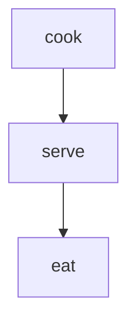
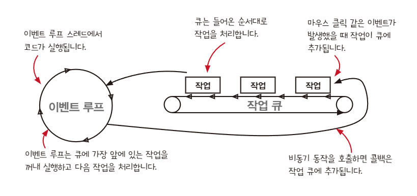

# 15. 타임라인 격리하기

- 코드를 타임라인 다이어그램으로 그리는 방법
- 버그를 찾기 위해 타임라인 다이어그램을 보는 방법
- 타임라인끼리 공유하는 자원을 줄여 코드 설계를 개선하는 방법

## 코드를 타임라인 다이어그램으로 그리는 방법

### 1. 두 액션이 순서대로 나타나면 같은 타임라인에 넣는다.

    - 동기적으로 실행된다면 같은 타임라인

### 2. 두 액션이 동시에 실행되거나 순서를 예상할 수 없다면 분리된 타임라인에 넣는다.

    - 비동기적으로 실행된다면 분리된 타임라인

### 예제

```js
function dinner(food) {
  cook(food);
  serve(food);
  eat(food);
}
```



### 주의할 점

1. ++와 += 는 실제로 세 단계를 거친다

```js
total++;

let temp = total; // 읽기 (액션)
temp = total + 1; // 계산
total = temp; // 쓰기 (액션)
```

2. 인자는 함수를 부리그 전에 실행된다.

```js
console.log(total);

const temp = total; // 읽기 (액션)
console.log(temp); // 로깅 (액션)
```

### 좋은 타임라인

1. 타임라인은 적을수록 이해하기 쉽다.
2. 타임라인은 짧을수록 이해하기 쉽다.
3. 공유하는 자원이 적을수록 이해하기 쉽다.
4. 자원을 공유한다면 서로 조율해야한다.
5. 시간을 일급으로 다룬다.

### 자바스크립트

- 자바스크립트는 스레드가 하나
- 전역변수를 바꾸는 동기 액션은 타임라인이 서로 섞이지 않는다.
- 비동기 호출은 미래에 알수 없는 시점에 런타임 의해 실행된다.
- 두 동기 액션은 동시에 실행되지 않는다.

#### 비동기 큐



- 자바스크립트 엔진은 작업 큐라고하는 큐를 가지고 있다.
- 작업큐는 이벤트 루프에 의해 처리된다.
- 이벤트 루프 동작

* 참고 (https://dev.to/lydiahallie/javascript-visualized-promises-async-await-5gke#syntax)


### add-to-cart 타임라인

1. 액션 확인하기

```js
function add_item_to_cart(name, price, quantity) {
  cart = add_item(cart, name, price, quantity); // cart 읽기, 쓰기 (액션)
  calc_cart_total();
}

function calc_cart_total() {
  total = 0; // total 쓰기 (액션)
  cost_ajax(cart, function (cost) {
    // cart 읽기, cost_ajax 호출
    total += cost; // total 읽기, 쓰기 (액션)
    shipping_ajax(cart, function (shipping) {
      // cart 읽기, shipping_ajax 호출
      total += shipping; // total 읽기, 쓰기 (액션)
      update_total_dom(total); // total 읽기, dom 그리기 (액션)
    });
  });
}
```

2. 순서대로 실행되거나 동시에 실행되는 액션 그리기

```
1. cart 읽기
2. cart 쓰기
3. total 쓰기
4. cart 읽기
5. cost_ajax 호출
                6. total 읽기
                7. total 쓰기
                8. cart 읽기
                9. shipping_ajax 호출
                                    10. total 읽기
                                    11. total 쓰기
                                    12. total 읽기
                                    13. update_total_dom 호출
```

3. 플랫폼에 특화된 지식을 사용해 다이어그램 단순화

- 하나의 타임라인에 있는 모든 액션을 하나로 통합

```
1. cart 읽기
   cart 쓰기
   total 쓰기
   cart 읽기
   cost_ajax 호출
                2. total 읽기
                   total 쓰기
                   cart 읽기
                   shipping_ajax 호출
                                    3. total 읽기
                                       total 쓰기
                                       total 읽기
                                       update_total_dom 호출
```

- 타임라인이 끝나는 곳에 새로운 타임라인이 하나 생긴다면 통합

```
1. cart 읽기
   cart 쓰기
   total 쓰기
   cart 읽기
   cost_ajax 호출

       |

2. total 읽기
   total 쓰기
   cart 읽기
   shipping_ajax 호출

       |

3. total 읽기
   total 쓰기
   total 읽기
   update_total_dom 호출
```

## 버그를 찾기 위해 타임라인 다이어그램을 보는 방법

```
1. cart 읽기                            1. cart 읽기
   cart 쓰기                               cart 쓰기
   total 쓰기                              total 쓰기
   cart 읽기                               cart 읽기
   cost_ajax 호출                          cost_ajax 호출

       |                                      |

2. total 읽기                           2. total 읽기
   total 쓰기                              total 쓰기
   cart 읽기                               cart 읽기
   shipping_ajax 호출                      shipping_ajax 호출

       |                                      |

3. total 읽기                           3. total 읽기
   total 쓰기                              total 쓰기
   total 읽기                              total 읽기
   update_total_dom 호출                   update_total_dom 호출
```

- 빠르게 더블 클릭을 할 경우

```
1. cart 읽기                                                        cart = []
   cart 쓰기                                                        cart = [신발]
   total 쓰기                                                       total = 0
   cart 읽기                                                        cart = [신발]
   cost_ajax 호출

       |

2. total 읽기                                                       total = 0
   total 쓰기                                                       total = 6 (신발)
   cart 읽기                                                        cart = [신발]
   shipping_ajax 호출

                                          1. cart 읽기              cart = [신발]
                                             cart 쓰기              cart = [신발, 신발]
                                             total 쓰기             total = 0
                                             cart 읽기              cart = [신발, 신발]
                                             cost_ajax 호출

                                                 |

                                          2. total 읽기             total = 0
                                             total 쓰기             total = 12
                                             cart 읽기              cart = [신발, 신발]
                                             shipping_ajax 호출

       |

3. total 읽기                                                       total = 12
   total 쓰기                                                       total = 14
   total 읽기                                                       total = 14
   update_total_dom 호출

                                                  |

                                          3. total 읽기             total = 14
                                             total 쓰기             total = 16
                                             total 읽기             total = 16
                                             update_total_dom 호출
```

## 타임라인끼리 공유하는 자원을 줄여 코드 설계를 개선하는 방법

- 공유하는 자원 total , cart 때문에 문제 발생 -> 전역변수를 지역변수로 변경

```diff
 function add_item_to_cart(name, price, quantity) {
   cart = add_item(cart, name, price, quantity); // cart 읽기, 쓰기 (액션)
-  calc_cart_total();
+  calc_cart_total(cart);
}

-function calc_cart_total() {
+function calc_cart_total(cart) {
+  let total = 0;
-  total = 0;
   cost_ajax(cart, function (cost) {
     total += cost;
     shipping_ajax(cart, function (shipping) {
       total += shipping;
       update_total_dom(total);
     });
   });
 }
```

### 더 재사용하기 좋은 코드로 변경하기

- 비동기 호출에서 명시적인 출력을 위해 리턴값 대신 콜백을 사용할 수 있다.

```diff
 function add_item_to_cart(name, price, quantity) {
   cart = add_item(cart, name, price, quantity); // cart 읽기, 쓰기 (액션)
-  calc_cart_total(cart);
+  calc_cart_total(cart, update_total_dom);
}

-function calc_cart_total(cart) {
+function calc_cart_total(cart, callback) {
   let total = 0;
   cost_ajax(cart, function (cost) {
     total += cost;
     shipping_ajax(cart, function (shipping) {
       total += shipping;
-      update_total_dom(total);
+      callback(total);
     });
   });
 }
```

## 요약

- 타임라인은 동시에 실행될 수 있는 순차적 액션을 말한다.
- 서로 다른 타임라인에 있는 액션은 끼어들 수 있어서 여러개의 실행 가능한 순서가 생긴다.
- 실행 가능한 순서가 많으면 코드가 항상 올바른 결과를 내는지 알기 어렵다.
- 자원을 공유하는 부분은 버그가 발생하기 쉽다.
- 공유자원을 확인하고 없애면 코드가 더 좋아진다.

## 나누고 싶은 얘기

- async / await 을 사용하는 경우에는 어떻게 될까?

```js
function add_item_to_cart(name, price, quantity) {
  cart = add_item(cart, name, price, quantity);
  calc_cart_total(cart, update_total_dom);
}

function calc_cart_total(cart, callback) {
  let total = 0;
  cost_ajax(cart, function (cost) {
    total += cost;
    shipping_ajax(cart, function (shipping) {
      total += shipping;
      callback(total);
    });
  });
}
```

```js
async function add_item_to_cart(name, price, quantity) {
  cart = add_item(cart, name, price, quantity);
  const total = await calc_cart_total(cart, update_total_dom);
  update_total_dom(total);
}

async function calc_cart_total(cart, callback) {
  const cost = await cost_ajax(cart);
  const shipping = await shipping_ajax(cart);

  const total = cost + shipping;
  return total;
}
```
