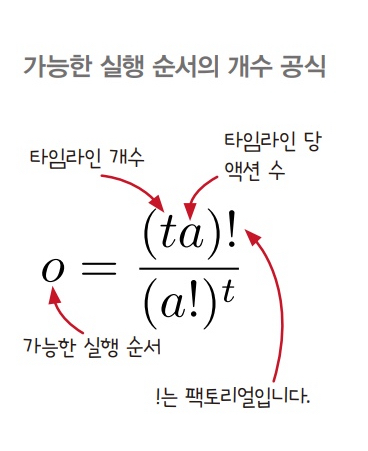
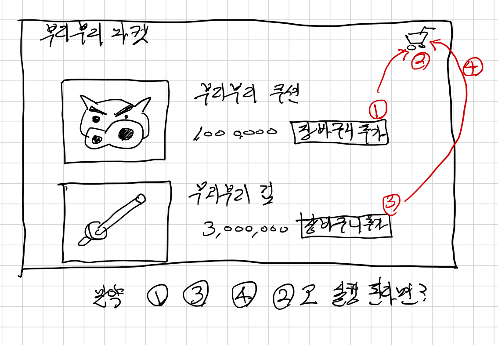
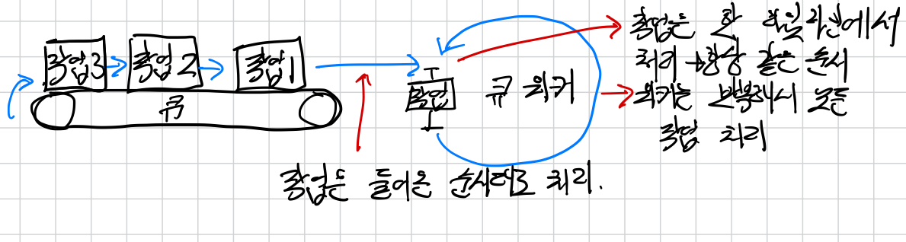

# 16. 타임라인 사이에 자원 공유하기

- 자원을 공유해서 생기는 버그를 찾는 방법을 배운다.
- 안전하게 자원을 공유하기 위해 동시성 기본형이라는 재사용 가능한 코드를 만드는 방법에 대해 알아본다.

## 좋은 타임라인의 원칙


1. 타임라인은 적을 수록 이해하기 쉽다.
   - 타임 라인 수(t)를 줄이면 시스템을 이해하기 더 쉽다.
2. 타임라인은 짧을 수록 이해하기 쉽다.
   - 타임라인 단계(u)를 줄이면 실행 가능한 순서를 많이 줄일 수 있다.
3. 공유하는 자원이 적을 수록 이해하기 쉽다.
    - 타임라인을 볼 때 자원을 공유하는 단계만 조심하면 된다.
    - 자원을 공유하는 단계를 줄이면 가능한 순서를 줄일 수 있다.
4. 자원을 공유한다면 서로 조율해야 한다.
   - 타임라인은 공유 자원을 안전하게 공유해야 한다.
   - 안전하게 공유한다는 말은 올바른 순서대로 자원을 쓰고 돌려준다는 말이다.
   - 타임라인을 조율한다는 것은 실행 가능한 순서를 줄인다는 것을 의미한다.
5. 시간을 일급으로 다룹니다.
   - 액션의 순서와 타이밍은 맞추기 어렵다.
   - 재사용 가능한 객체를 만들면 타이밍 문제를 쉽게 처리할 수 있다.

## DOM이 업데이트 되는 순서를 보장해야 한다.



- DOM 업데이트는 네트워크 요청이 완료되면 실행되고, 네트워크가 완료되는 시점은 통제할 수 없는 많은 변수에 의존한다.



- 큐는 들어온 순서대로 나오는 데이터 구조다.
- 큐는 여러 타임 라인에 있는 액션 순서를 조율하기 위해 많이 사용된다.
- 큐는 공유 자원이지만 안전하게 공유된다.
- 큐에 있는 모든 작업은 같은 타임라인에서 처리되기 때문에 순서가 괸리된다.

- 타임라인이 전역 변수, DOM, 지역 변수를 공유하는 것, 데이터베이스, API 호출을 공유하면 문제가 될 수 있다.

## 자바스크립트에서 큐 만들기

### 큐에서 처리할 작업을 큐에 넣고 첫 번째 항목 실행하기

```diff
function add_item_to_cart(item){
    cart = add_item(cart, item);
-   calc_cart_total(cart, update_total_dom);
+   update_total_queue(cart); 
}

function calc_cart_total(cart, callback){
   const total = 0;
   const _ajax(cart, (cost) => {
      total += cost;
      shipping_ajax(cart, (shipping) => {
         total += shipping;
         callback(total);
      })
   })
}

+ const queue_items = [];

+ function runNext(){
+   const cart = queue_items.shift();
+   calc_cart_total(cart, update_total_dom);
+ }

+ function update_total_queue (cart) {
+   queue_items.push(cart);
+   setTimeout(runNext, 0);
+ }
```

### 두 번째 타임라인이 첫 번째 타임라인과 동시에 실행되는 것을 막고 다음 작업 시작하기

```diff
const queue_items = [];
+ let working = false;

function runNext(){
+ if(working){
+   return;
+ }
+ working = true;
  const cart = queue_items.shift();
- calc_cart_total(cart, update_total_dom);
+ calc_cart_total(cart, (total) => {
+   update_total_dom(total);
+   working = false;
+   runNext();
+ });
}
```

### 항목이 없을 때 멈추게 하기

```diff
function runNext(){
  if(working){
    return;
  }
+ if(queue_items.length === 0)
+   return;
  working = true;
  const cart = queue_items.shift();
  calc_cart_total(cart, (total) => {
    update_total_dom(total);
    working = false;
    runNext();
  });
}
```

### 변수와 함수를 함수 범위로 넣기

```js
function Queue() {
   const queue_items = [];
   let working = false;

   function runNext(){
      if(working)
         return;
      if(queue_items.length === 0) 
          return;
      working = true;
      const cart = queue_items.shift();
      calc_cart_total(cart, (total) => {
         update_total_dom(total);
         working = false;
         runNext();
      });
   }
   
   return (cart) => {
       queue_items.push(cart);
       setTimeout(runNext, 0);
   };
}

const update_total_queue = Queue();
```

## 큐를 재사용할 수 있게 만들기

### done() 함수 빼내기

```js
function Queue() {
   const queue_items = [];
   let working = false;

   function runNext(){
      if(working)
         return;
      if(queue_items.length === 0) 
          return;
      working = true;
      const cart = queue_items.shift();
      function worker (cart, done){
         calc_cart_total(cart, (total) => {
             update_total_dom(total);
             done(total)
         });
      }
      worker(cart, () => {
         working = false;
         runNext();
      });
   }
   
   return (cart) => {
       queue_items.push(cart);
       setTimeout(runNext, 0);
   };
}

const update_total_queue = Queue();
```

### 워커 행동을 바꿀 수 있도록 밖으로 빼기

```js
function Queue(worker) {
   const queue_items = [];
   let working = false;

   function runNext(){
      if(working)
         return;
      if(queue_items.length === 0) 
          return;
      working = true;
      const cart = queue_items.shift();
      worker(cart, () => {
         working = false;
         runNext();
      });
   }
   
   return (cart) => {
       queue_items.push(cart);
       setTimeout(runNext, 0);
   };
}

function calc_cart_worker (cart, done){
   calc_cart_total(cart, (total) => {
      update_total_dom(total);
      done(total)
   });
}

const update_total_queue = Queue(calc_cart_worker);
```

### 작업이 끝났을 때 실행하는 콜백 받기 (추상화 하기)

```js
function Queue(worker) {
   const queue_items = [];
   let working = false;

   function runNext(){
      if(working)
         return;
      if(queue_items.length === 0) 
          return;
      working = true;
      const item = queue_items.shift();
      worker(item.data, (val) => {
         working = false;
         setTimeout(item.callback, 0, val);
         runNext();
      });
   }
   
   return (data, callback) => {
       queue_items.push({
          data,
          callback: callback || function(){}
       });
       setTimeout(runNext, 0);
   };
}

function calc_cart_worker (cart, done){
   calc_cart_total(cart, (total) => {
      update_total_dom(total);
      done(total)
   });
}

const update_total_queue = Queue(calc_cart_worker);
```

- 큐는 액션에 순서를 보장하는 도구다.
- `linearize`라고도 불린다.
- 큐는 동시성 기본형이다.
- 동시성 기본형이란 자원을 안전하게 공유할 수 있는 재사용 가능한 코드를 말한다.

## 드로핑 큐 만들기

- 비동기 작업을 동기로 바꿔서 먼저 실행된 요청이 오래 걸린다면?

```js
function DroppingQueue(max, worker){
   const queue_items = [];
   let working = false;

   function runNext(){
      if(working)
         return;
      if(queue_items.length === 0)
         return;
      working = true;
      const item = queue_items.shift();
      worker(item.data, (val) => {
         working = false;
         setTimeout(item.callback, 0, val);
         runNext();
      });
   }

   return (data, callback) => {
      queue_items.push({
         data,
         callback: callback || function(){}
      });
      while(queue_items.length > max)
        queue_items.shift()
      setTimeout(runNext, 0);
   };   
}

function calc_cart_worker (cart, done){
   calc_cart_total(cart, (total) => {
      update_total_dom(total);
      done(total)
   });
}

const update_total_queue = DroppingQueue(1, calc_cart_worker);
```

## 정리

- 재사용 가능한 도구를 만들면 자원 공유에 도움이 된다.
- 자원 공유를 위한 도구를 동시성 기본형이라고 부른다.
- 동시성 기본형을 사용하면 코드가 더 깨끗하고 단순해진다.

## 나누고 싶은 이야기

- 저는 이해가 어려웠는데 다들 어떠셨나요?