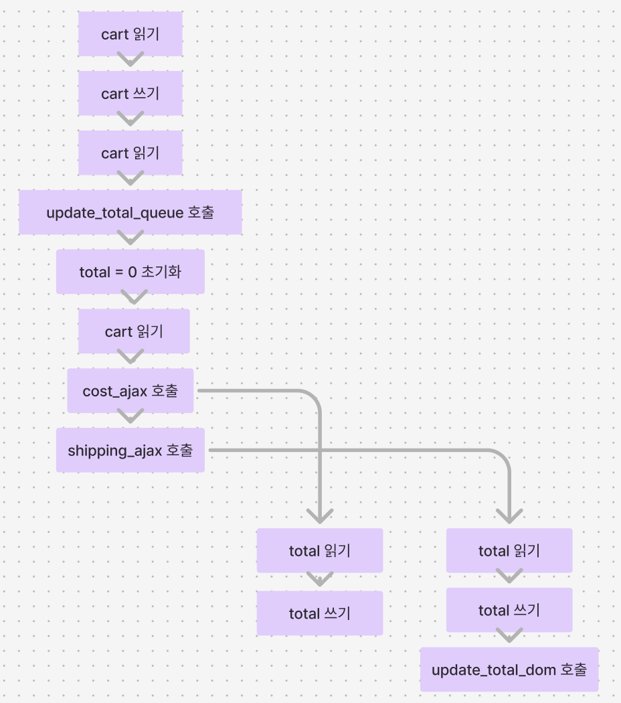
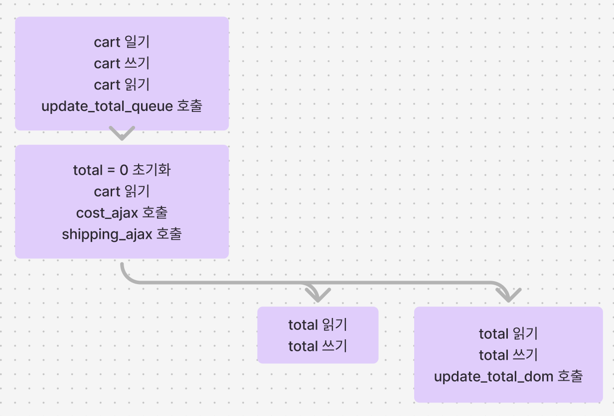
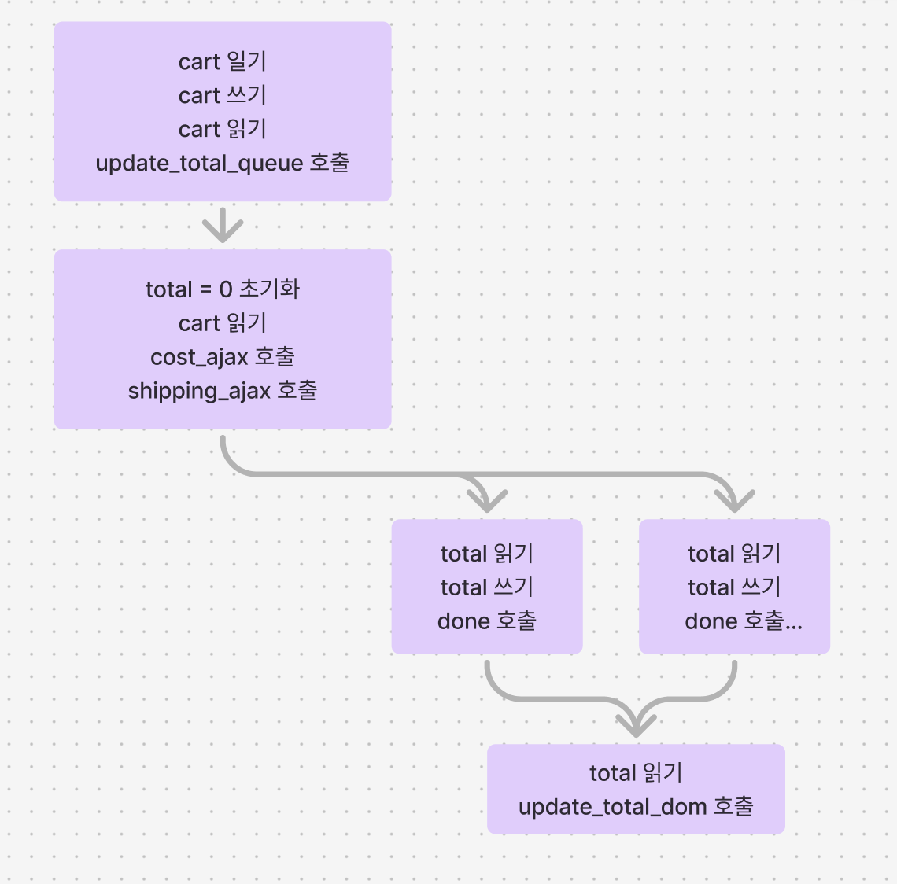

# 17 타임라인 조율하기

## 최적화 전 / 후

```js
function DroppingQueue(max, worker) {
  const queue_items = [];
  let working = false;

  function runNext() {
    if (working) return;
    if (queue_items.length === 0) return;
    working = true;
    const item = queue_items.shift();
    worker(item.data, (val) => {
      working = false;
      setTimeout(item.callback, 0, val);
      runNext();
    });
  }

  return (data, callback) => {
    queue_items.push({
      data,
      callback: callback || function () {},
    });
    while (queue_items.length > max) queue_items.shift();
    setTimeout(runNext, 0);
  };
}

function calc_cart_worker(cart, done) {
  calc_cart_total(cart, (total) => {
    update_total_dom(total);
    done(total);
  });
}

const update_total_queue = DroppingQueue(1, calc_cart_worker);
```

### 최적화 전

```js
function add_item_to_cart(item) {
  cart = add_item(cart, item);
  update_total_queue(cart);
}

function calc_cart_total(cart, callback) {
  let total = 0;
  cost_ajax(cart, function (cost) {
    total += cost;

    shipping_ajax(cart, function (shipping) {
      total += shipping;
      callback(total);
    });
  });
}

function calc_cart_worker(cart, done) {
  calc_cart_total(cart, function (total) {
    update_total_dom(total);
    done(total);
  });
}

const update_total_queue = DroppingQueue(1, calc_cart_worker);
```

### 최적화 후

```js
function add_item_to_cart(item) {
  cart = add_item(cart, item); // cart 읽기, 쓰기
  update_total_queue(cart); // 카트 읽기, update_total_queue 호출
}

function calc_cart_total(cart, callback) {
  let total = 0; // total 쓰기
  cost_ajax(cart, function (cost) {
    // cart 읽기, cost_ajax 호출
    total += cost; // total 읽기, 쓰기
  });

  shipping_ajax(cart, function (shipping) {
    // cart 읽기, shipping_ajax 호출
    total += shipping; // total 읽기, 쓰기
    callback(total); // total 읽기
  });
}

function calc_cart_worker(cart, done) {
  calc_cart_total(cart, function (total) {
    update_total_dom(total); // update_total_dom 부르기
    done(total);
  });
}

const update_total_queue = DroppingQueue(1, calc_cart_worker);
```

### 액션

1. cart 읽기
2. cart 쓰기
3. cart 읽기
4. update_total_queue 호출
5. total 쓰기
6. cost_ajax 호출
7. total 읽기
8. total 쓰기
9. shipping_ajax 호출
10. total 읽기
11. total 쓰기
12. total 읽기
13. update_total_dom 호출



- 다이어그램 단순화 ( 타임라인 통합 )



### cut 함수로 동시성 제어

```js
function cut(num, callback) {
  let numFinished = 0;
  return function () {
    numFinished += 1;
    if (numFinished === num) {
      callback();
    }
  };
}

function calc_cart_total(cart, callback) {
  let total = 0;
  const done = cut(2, () => callback(total));

  cost_ajax(cart, (cost) => {
    total += cost;
    done();
  });

  shipping_ajax(cart, (shipping) => {
    total += shipping;
    done();
  });
}
```



### Promise 를 활용한 동시성 제어

```js
async function calc_cart_total(cart) {
  const [cost, shipping] = await Promise.all([
    () => cost_ajax(cart),
    () => shipping_ajax(cart),
  ]);

  const total = cost + shipping;
  return total;
}
```

### JustOnce

```js
function JustOnce(action) {
  let alreadyCalled = false;
  return function (...args) {
    if (alreadyCalled) return;
    alreadyCalled = true;
    return action(args);
  };
}

const sendAddToCartTextOnce = JustOnce(sendAddToCartText);

// 한번만 호출됨
sendAddToCartTextOnce("555-555-555");
sendAddToCartTextOnce("555-555-555");
sendAddToCartTextOnce("555-555-555");
sendAddToCartTextOnce("555-555-555");
```

## 요약
