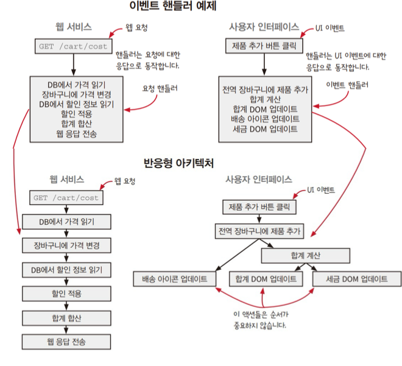
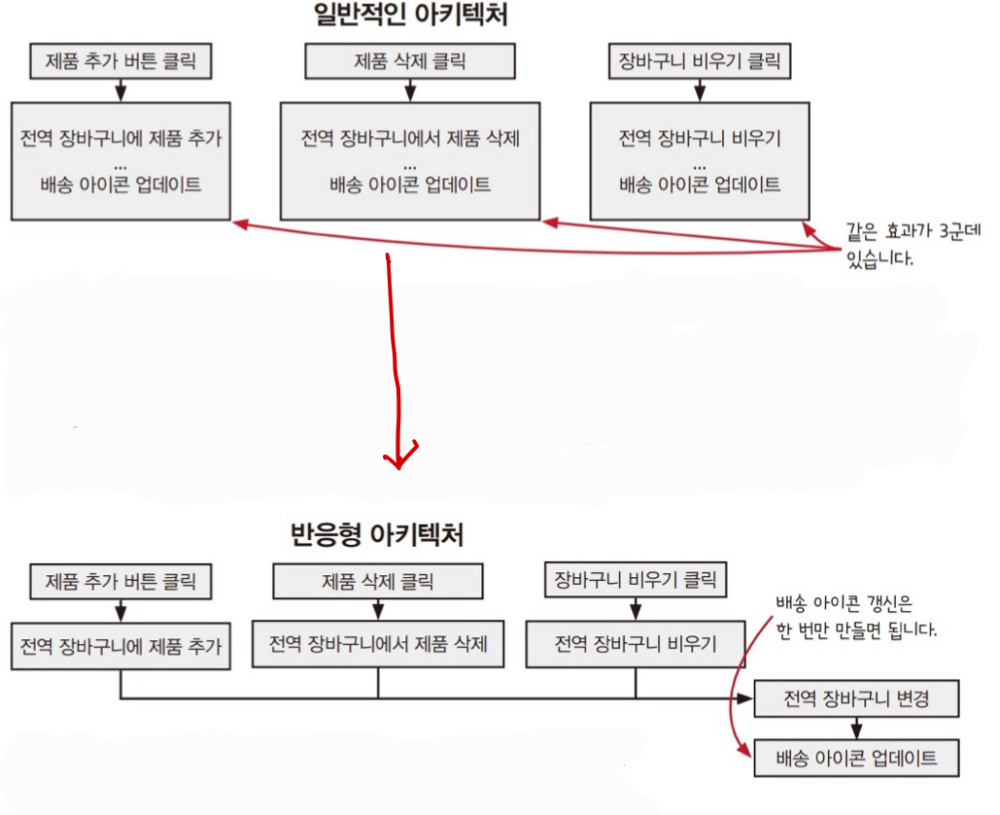
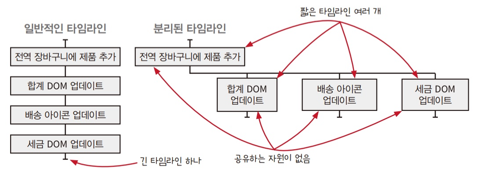
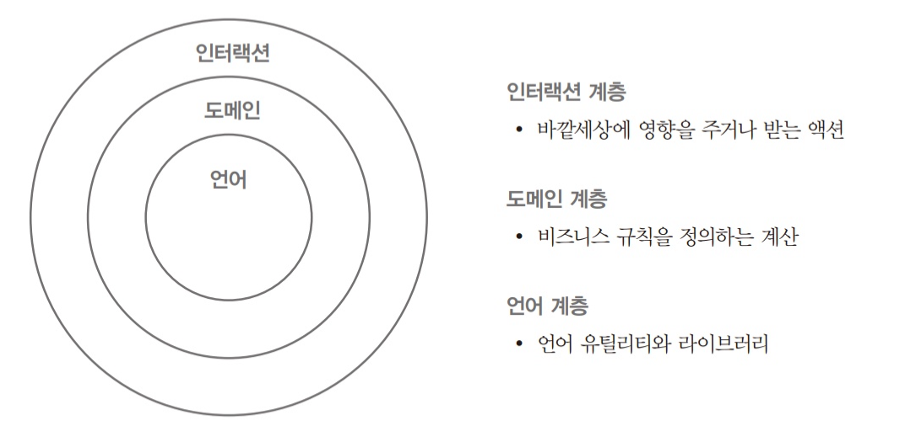
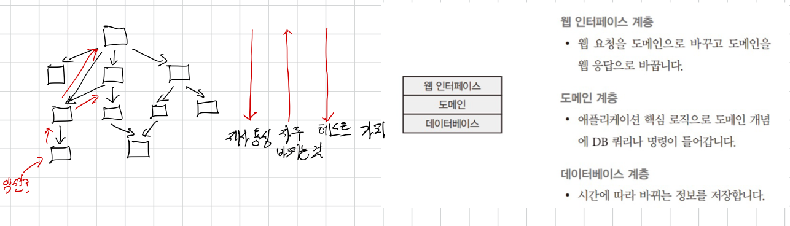
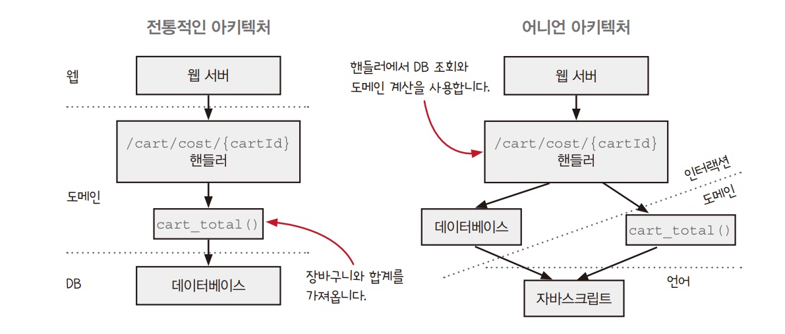

# 18. 반응형 아키텍처와 어니언 아키텍처

- 두 패턴은 함께 사용할 수도 있지만 따로 사용할 수도 있다.

## 반응형 아키텍처

- 순차적 액션 단계에서 사용.
- 코드에 나타난 순차적 액션의 순서를 뒤집는다?
- 효과와 효과에 대한 원인을 분리해서 코드에 복잡하게 꼬인 부분을 풀 수 있다.



- 장바구니는 전역 상태다.
- 장바구니는 언제 바뀔지 모른다.
- 상태를 일급 함수로 만들어 보자.
- 전역 변수를 몇 가지 동작과 함께 객체로 만든다.

```js
function ValueCell(initialValue) {
    const currentValue = initialValue;
    return {
        val: () => currentValue;
        update: (f) => {
            const oldValue = currentValue;
            const newValue = f(oldValue);
            currentValue = newValue;
        }
    };
}
```

- `ValueCell`에는 값 하나와 두 개의 동작이 있다.
- 값을 읽는 동작, 현재 값을 바꾸는 동작.

```diff
- const shopping_cart = {};
+ const shopping_cart = ValueCell({});

function add_item_to_cart(name, price){
    const item = make_cart_item(name, price);
-   shopping_cart = add_item(shopping_cart, item);
+   shopping_cart.update((cart) => add_item(cart, item));

    const total = calc_total(shopping_cart.val());
    set_cart_total_dom(total);
    update_shipping_icons(shopping_cart.val());
    update_tax_dom(total);
}
```

- 장바구니를 읽고 쓰는 코드는 명확한 메서드 호출로 바꿨다.
- ValueCell 코드에 감시자 개념을 추가해보자.
- 감시자는 상태가 바뀔 때마다 실행되는 핸들러 함수다.

```js
function ValueCell(initialValue) {
    const currentValue = initialValue;
    const watchers = [];
    return {
        val: () => currentValue;
        update: (f) => {
            const oldValue = currentValue;
            const newValue = f(oldValue);
            if(oldValue !== newValue){
                currentValue = newValue;
                watchers.forEach(watcher => watcher(newValue));
            }
        },
        addWatcher: (f) => watchers.push(f);
    };
}
```

```diff
+ const shopping_cart = ValueCell({});

function add_item_to_cart(name, price){
    const item = make_cart_item(name, price);
    shopping_cart.update((cart) => add_item(cart, item));

    const total = calc_total(shopping_cart.val());
    set_cart_total_dom(total);
-    update_shipping_icons(shopping_cart.val());
    update_tax_dom(total);
}

+ shopping_cart.addWatcher(update_shipping_icons);
```

- 이제 장바구니가 바뀔 때 항상 배송 아이콘이 갱신된다.
- 코드를 고치고 나서 핸들러 함수가 작아지고 장바구니를 바꾸는 모든 핸들러에서 `update_shipping_icons()`를 부르지 않아도 된다.
- 이제 장바구니의 값이 바뀌면 `total`값이 따라서 바뀌는 파생된 값을 관리하는 기본형을 만들어 보자.

```js
function FormulaCell(upstreamCell, f) {
  const myCell = ValueCell(f(upstreamCell.val()));
  upstreamCell.addWatcher((newUpstreamValue) => myCell.update((currentValue) => f(newUpstreamValue)));

  return {
    val: myCell.val,
    addWatcher: myCell.addWatcher,
  };
}
```

- `FormulaCell`로 이미 있는 셀에서 파생한 셀을 만들 수 있다.
- 다른 셀의 변화가 감지되면 값을 다시 계산한다.

```diff
const shopping_cart = ValueCell({});
+ const cart_total = FormulaCell(shopping_cart, calc_total);

function add_item_to_cart(name, price){
    const item = make_cart_item(name, price);
    shopping_cart.update((cart) => add_item(cart, item));

    const total = calc_total(shopping_cart.val());
-    set_cart_total_dom(total);
-    update_shipping_icons(shopping_cart.val());
-    update_tax_dom(total);
}

shopping_cart.addWatcher(update_shipping_icons);
+ cart_total.addWatcher(set_cart_total_dom);
+ cart_total.addWatcher(update_tax_dom);
```

### 반응형 아키텍처가 바꾼 시스템의 결과

#### 1. 원인과 효과가 결합된 것을 분리한다.



#### 2. 여러 단계를 파이프라인으로 처리한다.

#### 3. 타임라인이 유연해진다.



## 어니언 아키텍처



- 서비스의 모든 단계에 사용.
- 웹 서비스나 온도 조절 장치 같은 현실 세계와 상호작용하기 위한 서비스 구조를 만든다.
- 위의 간단한 그림으로 함수형 시스템이 잘 동작할 수 있는 중요한 규칙을 알 수 있다.
  1. 현실 세계와 상호작용은 인터렉션 계층에서 해야 한다.
  2. 계층에서 호출하는 방향은 중심 방향이다.
  3. 계층은 외부에 어떤 계층이 있는지 모른다.
- 4장에서 배운대로 액션에서 계산을 빼내면 의도하지 않아도 어니언 아키텍처 구조가 된다.

### 걔층형 설계 vs 전통적인 아키텍처



- 전통적인 계층형 아키텍처는 데이터 베이스 계층은 액션이기 때문에 그 위에 계층은 모두 액션이 되기 때문에 함수형 스타일이 아니다.

### 전통적인 아키텍처 vs 어니언 아키텍처



- `cart_total()`은 제품 가격을 가지고 장바구니 합계를 만드는 계산으로 장바구니가 어디에서 왔는지 모른다.
- 핸들러가 데이터베이스에서 장바구니를 가져와 도메인에 전달하는 역할을 한다.

### 도메인 규칙은 도메인 용어를 사용한다.

```js
const image = newImageDB.getImage("123");
if (image === undefined) image = oldImageDB.getImage("123");
```

- 위 코드가 비지니스에 중요한 부분이라고 해도 이 코드는 도메인 규칙이 아니다.
- 도메인 규칙에는 제품, 이미지, 가격, 할인과 같은 용어를 사용한다.
- 데이터베이스는 도메인을 나타내는 용어가 아니다.

```js
function getWithRetries(url, retriesLeft, success, error) {
  if (retriesLef <= 0) {
    error("No more retries");
  } else {
    ajaxGet(url, success, (e) => getWithRetries(url, retriesLeft - 1, success, error));
  }
}
```

- 웹 요청이 실패할 때 재시도를 하는 로직이 중요한 기능이라고 해도 도메인 용어를 사용하지 않기 때문에 비지니스 규칙이 아니다.
- 위 두 코드 모두 인터렉션 걔층에 속하는 코드다.

## 정리

- 반응형 아키텍처는 X를 하고 Y를 하는 것을 X가 발생하면 Y를 하도록 바꿉니다.
- 반응형 아키텍처는 액션과 계산을 조합해 파이프라인을 만든다. 파이프라인은 순서대로 발생하는 작은 액션들의 조합이다.
- 어니언 아키텍처는 넓은 범위에서 소프트웨어를 인터렉션, 도메인, 언어 계층으로 나눕니다.
- 가장 바깥 인터렉션 계층은 액션으로 되어 있고 도미엔 계층과 액션을 사용하는 것을 조율한다.
- 도메인 계층은 도메인 로직과 비지니스 규칙같은 소프트웨어의 동작으로 되어있고 대부분 계산으로 구성된다.
- 어니언 아키텍처는 이상적인 모습으로 현실과 사이를 균형있게 유지하는 것이 중요하다.

## 나누고 싶은 이야기

- 이렇게 놓고 보니 리액트가 함수형 프로그래밍을 선택했고 많은 부분을 대신 해준다고 느끼네요. 어떠셨나요?
