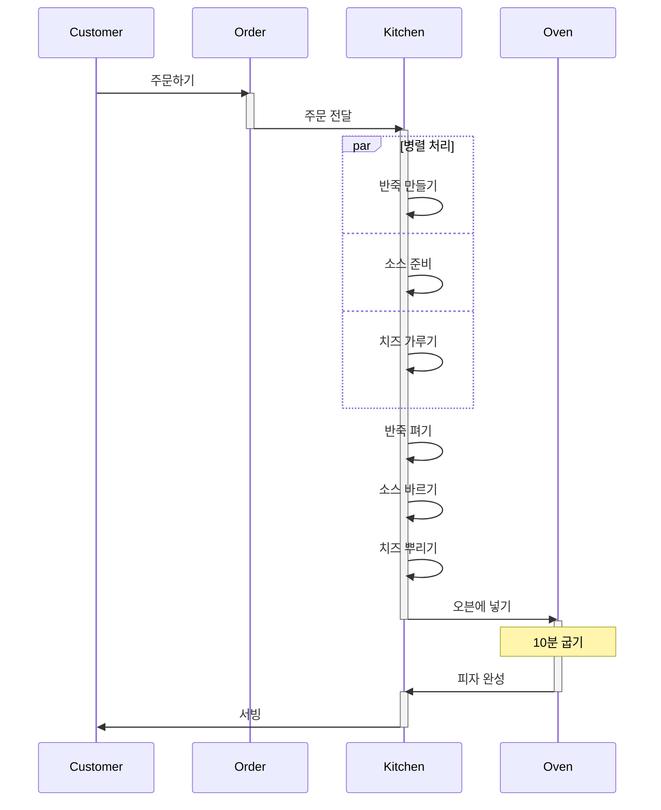

# 2. 현실(피자 만들기)에서의 함수형 사고

## 액션과 계산 데이터

### 1. 액션

> 외부와의 상호작용  
> 시간에 의존적  
> 동일한 입력에도 다른 결과가 나올 수 있음  
> 부수 효과가 있음 ( 상태 변경, 외부 시스템 호출 )

- 반죽 펴기
- 피자 배달
- 재료 주문

### 2. 계산

> 입력이 같으면 항상 같은 출력 값을 가짐 (순수함수)  
> 외부 상태를 변경하지 않음  
> 시간에 독립적  
> 부수 효과가 없음

- 조리법에 나온 것을 두 배로 만들기
- 쇼핑 목록 결정

### 3. 데이터

> 단순한 정보를 담고 있는 것  
> 그 자체로는 아무런 행위도 하지 않음  
> 불변셩을 가짐

- 고객 주문
- 영수증
- 조리법

## 계층화 설계

- 비즈니스 규칙, 도메인 규칙, 기술스택 계층으로 나뉜다.
- 상위 계층일수록 자주 변경되는 것
- 하위 계층일수록 자주 변경되지 않는 것
- 각 계층은 그 아래에 있는 계층을 기반으로 만들어 집니다.
- 테스트, 재사용, 유지 보수가 쉬워진다.

### 계층

1. 비즈니스 규칙
   - 전체 비즈니스 프로세스를 다룸
   - 무엇을(What) 할지 결정
   - 전체적인 목표와 방향만 결정
2. 도메인 규칙
   - 큰 작업을 작은 작업으로 나누어 관리
   - 구체적인 업무 규칙과 도메인 로직
   - 어떻게(How) 할지 결정
3. 기술 스택
   - 실제로 일이 처리되는 곳
   - 실제 기술적 구현
   - 구체적인 작업 수행

### 피자 주방 레이어

1. 비지니스 규칙
   - 이번 주 메뉴
2. 도메인 규칙
   - 피자 만들기
3. 기술 스택
   - 자바스크립트 (객체, 배열)

### 창고 레이어

1. 비지니스 규칙
   - 이번 주 사야 할 것
2. 도메인 규칙
   - 재료 목록
3. 기술 스택
   - 자바스크립트 (객체, 숫자)

## 일급 추상

- 함수를 값처럼 다룰 수 있다
- 함수를 변수에 할당할 수 있다
- 함수를 다른 함수의 인자로 전달할 수 있다
- 함수에서 함수를 반환할 수 있다

### 타임라인 다이어그램

1. 주문 접수
2. 반죽 만들기
3. 반죽 펴기
4. 소스 만들기
5. 소스 뿌리기
6. 치즈 갈기
7. 치즈 뿌리기
8. 오븐에 넣기
9. 10분 기다리기
10. 서빙

- 순서가 중요한 작업

  - (기본 재료 준비)
    - 반죽 만들기 -> 반죽 펴기
    - 소스 만들기 -> 소스 뿌리기
    - 치즈 갈기 -> 치즈 뿌리기
  - (피자 준비)
    - 반죽 펴기 -> 소스 뿌리기
    - 소스 뿌리기 -> 치즈 뿌리기
    - 치즈 뿌리기 -> 오븐에 넣기
    - 오븐에 넣기 -> 10분 기다리기
    - 10분 기다리기 -> 서빙

- 각각 독립적인 액션을 분산 시스템으로 전환
  - 기본 재료 준비 (반죽, 소스, 치즈) -> 피자 준비

> 문제점 : 기본 재료 준비 과정중 누가 먼저 끝날지 알수가 없다!



- 타임라인 커팅

```javascript
function cut(num, callback) {
  let numFinished = 0;
  return function () {
    numFinished += 1;
    if (numFinished === num) {
      callback();
    }
  };
}

function 피자재료만들기(다음작업) {
  const 피자재료 = [];
  const 완료 = cut(3, () => 다음작업());

  반죽만들기((반죽) => {
    피자재료.push(반죽);
    완료();
  });

  소스만들기((소스) => {
    피자재료.push(소스);
    완료();
  });

  치즈갈기((치즈) => {
    피자재료.push(치즈);
    완료();
  });
}
```

### 전체 흐름 ( 추측 )

```typescript
// 1. 비지니스 계층
const 피자주문처리 = async (주문: 주문서) => {
  // 피자 종류 선택하는 로직
  const 피자 = await 피자만들기();
  return 서빙(피자);
};

// 2. 도메인 계층
const 피자만들기 = async () => {
  const [반죽, 소스, 간치즈] = await 기본재료준비();
  const 펴진반죽 = 반죽펴기(반죽);
  const 소스반죽 = 소스뿌리기(펴진반죽);
  const 치즈소스반죽 = 치즈뿌리기(소스도우);
  const 피자 = 피자굽기(치즈소스반죽);
  return 피자;
};

const 기본재료준비 = async () => {
  const [반죽, 소스, 간치즈] = await Promise.all([
    반죽만들기(),
    소스만들기(),
    치즈갈기(),
  ]);
  return [반죽, 소스, 간치즈];
};

// 3. 기술 스택 (typescript)
const 반죽만들기 = async () => 반죽;
const 소스만들기 = async () => 소스;
const 치즈갈기 = async () => 간치즈;
const 반죽펴기 = (반죽) => 펴진반죽;
const 소스뿌리기 = (펴진반죽) => 소스반죽;
const 치즈뿌리기 = (소스반죽) => 치즈소스반죽;
const 피자굽기 = (치즈소스반죽) => 피자;
const 서빙 = (피자) => {};

interface 주문서 {
  종류: string;
  개수: number;
}
```

## 요약

1. 액션과 계산, 데이터를 구분하는 일이 가장 중요하고 가장 먼저 해야하는 일이다.
2. 유지보수를 잘 하기 위해서 계층형 설계를 사용한다.
3. 타임라인 다이어그램은 시간에 따라 변화는 액션을 시각화 하는 일이다.

## 토론하고 싶은 주제

1. 일급 추상은 무엇인가?
