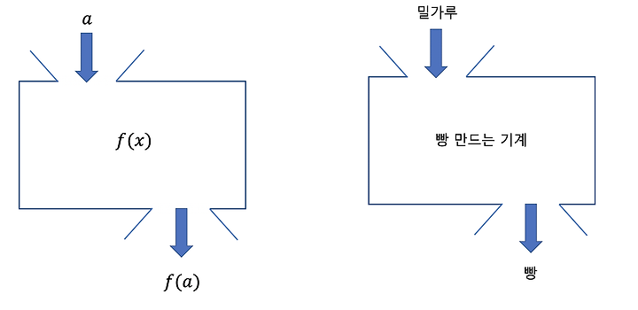

# 2. 액션과 계산, 데이터의 차이를 알기

## 액션, 계산, 데이터 차이

| 액션                                                                                                                  | 계산                                                                              | 데이터             |
| --------------------------------------------------------------------------------------------------------------------- | --------------------------------------------------------------------------------- | ------------------ |
| 실행 시점과 횟수에 의존한다.  다른 말로 부수효과, 부수효과가 있는 함수, 순수하지 않은 함수라고 부르기도 한다. | 입력으로 출력을 계산한다.  다른말로 순수함수, 수학함수라고 부르기도 한다. | 이벤트에 대한 사실 |

이렇게 보니 구분이 어려운데, 실제로는 데이터/계산 을 제외하고는 다 액션으로 취급하는 것 같다.

함수형 프로그래밍은 "코딩" 자체에 대한 이야기가 아니다.

페러다임처럼 생각하는 방법에 대한 이야기이기도 하다.

## 참조 투명

계산은 계산을 호출하는 코드를 계산 결과로 바꿀 수 있기 때문에 `참조 투명(referentially transparent`)`라고 한다.

## 액션과 나눌 수 있다.

액션은 행위로 취급한다.

그렇기에 추상적일 수 있으며, 나눌 수 있다.

반대로 계산은 입력에 대해서 일정한 출력이 있다.

그렇기에, 더 작은 입력 -> 출력 단위로 나눌 수 있다.

A가 들어오면 반드시 B! 이런 과정이 필요하기 때문에 그렇다.

## 데이터란 무엇인가?

JS에서는 기본 데이터 타입으로 구현한다.

데이터 구조를 통해 의미를 담을 수 있다.

### 불변성

JS에서는 불변 데이터를 다루기 위해서 2가지 원칙을 사용한다.

- 카피-온-라이트(copy-on-write)
- 방어적 복사(defensive copy)

### 데이터의 장점

- 직렬화 (JSON을 기억하면 된다.)
- 동일성 비교 : 데이터는 액션, 계산에 비해서 비교가 쉽다.
- 자유로운 해석 : 여러가지 방법으로 해석이 가능하다.

### 데이터의 단점

반드시 해석이 필요하다는 단점이 있다.

### 이벤트에 대한 사실

이벤트에 대한 사실로 정의하기도 한다.

## 논의 사항

- JS에서 계산과 액션은 함수로 표현된다.
- 그러면 어떻게 구분할 수 있는가?
