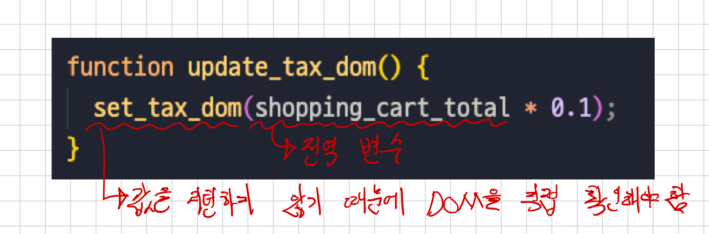

# 4. 액션에서 계산 빼내기

## 변경 전 코드

```js
var shopping_cart = [];
var shopping_cart_total = 0;

function add_item_to_cart(name, price) {
  shopping_cart.push({
    name: name,
    price: price,
  });
  calc_cart_total();
}

function calc_cart_total() {
  shopping_cart_total = 0;
  for (var i = 0; i < shopping_cart.length; i++) {
    var item = shopping_cart[i];
    shopping_cart_total += item.price;
  }
  set_cart_total_dom();
  update_shipping_icons();
  update_tax_dom();
}

// 20 달러 이상이면 무료 배송 아이콘 추가
function update_shipping_icons() {
  var buy_buttons = get_buy_buttons_dom();
  for (var i = 0; i < buy_buttons.length; i++) {
    var button = buy_buttons[i];
    var item = button.item;
    if (item.price + shopping_cart_total >= 20) {
      button.show_free_shipping_icon();
    } else {
      button.hide_free_shipping_icon();
    }
  }
}

function update_tax_dom() {
  set_tax_dom(shopping_cart_total * 0.1);
}
```

### 테스트가 어려운 이유



1. 전역 변수를 사용해야 하기 때문에 테스트마다 전역 변수를 설정해야 함.
2. 값을 리턴하지 않고 DOM에 바로 넣기 때문에 결과를 DOM을 통해 확인해야 함.

### 개선 방법

1. DOM 업데이트와 비지니스 규칙 분리
2. 전역 변수 제거

### 재사용하기 어려운 이유

```js
function update_shipping_icons() {
  var buy_buttons = get_buy_buttons_dom();
  for (var i = 0; i < buy_buttons.length; i++) {
    var button = buy_buttons[i];
    var item = button.item;
    if (item.price + shopping_cart_total >= 20) {
      button.show_free_shipping_icon();
    } else {
      button.hide_free_shipping_icon();
    }
  }
}
```

1. 전역 변수, `shopping_cart_total`이 있어야만 사용할 수 있음.
2. DOM(`button`)이 있어야만 실행할 수 있음.
3. 리턴값이 없어 결과를 받을 방법이 없음.

> 함수를 작은 단위로 분리하면 좋은 점을 얘기하는 것 같기도 합니다.
> 책에서는 `>= 20`을 다른 팀에서 재사용한다고 했지만, 그것보단 함수를 작은 단위로 분리하면 다른 곳에서 재사용할 수 있다는 것을 말하고 싶은 것 같아요.
> 작은 단위라고 하면 아마 하나의 책임이 아닐까 싶습니다.

### 개선 방법

1. 전역 변수에 의존하지 말아야 한다.
2. DOM을 사용할 수 있는 곳에서 실행된다고 가정하면 안 된다(테스트 개선 방안 2).
3. 함수가 결과값을 리턴해야 한다.

### 함수에는 입력과 출력이 있다.

- 입력: 인자, 전역 변수를 읽는 행위 등
- 출력: 리턴값, 전역 변수를 변경하는 행위, 콘솔 출력 등

입력과 출력은 암묵적일 수 있다.

- 인자로 들어오는 입력, 리턴하는 출력을 제외하고 외부 정보를 읽고, 바꾸는 건 암묵적인 입출력이다.

함수에 암묵적 입출력이 있으면 액션이다.
= 암묵적 입력을 인자로, 암묵적 출력을 리턴값으로 바꾸면 계산이 된다.
= 암묵적 입출력은 부수효과다.

### 중간 정리

테스트와 재사용성을 위해서는 암묵적 입출력을 없애야 한다.

암묵적 입출력을 없애기 위해서는

- [ ] DOM 업데이트와 비지니스 규칙 분리
- [ ] 전역 변수 제거
- [ ] 함수의 명시적 입출력

## 액션에서 계산 빼내기

### calc_cart_total

```js
function calc_cart_total() {
  shopping_cart_total = 0;
  for (var i = 0; i < shopping_cart.length; i++) {
    var item = shopping_cart[i];
    shopping_cart_total += item.price;
  }
  set_cart_total_dom();
  update_shipping_icons();
  update_tax_dom();
}
```

#### 1. 서브 루틴 추출하기

```js
function calc_cart_total() {
  calc_total();
  set_cart_total_dom();
  update_shipping_icons();
  update_tax_dom();
}

function calc_total() {
  shopping_cart_total = 0;
  for (var i = 0; i < shopping_cart.length; i++) {
    var item = shopping_cart[i];
    shopping_cart_total += item.price;
  }
}
```

#### 2. 암묵적 출력 제거

```js
function calc_cart_total() {
  shopping_cart_total = calc_total();
  set_cart_total_dom();
  update_shipping_icons();
  update_tax_dom();
}

function calc_total() {
  var total = 0;
  for (var i = 0; i < shopping_cart.length; i++) {
    var item = shopping_cart[i];
    total += item.price;
  }
  return total;
}
```

#### 3. 암묵적 입력 제거

```js
function calc_cart_total() {
  shopping_cart_total = calc_total(shopping_cart_total);
  set_cart_total_dom();
  update_shipping_icons();
  update_tax_dom();
}

function calc_total(cart) {
  var total = 0;
  for (var i = 0; i < cart.length; i++) {
    var item = cart[i];
    total += item.price;
  }
  return total;
}
```

### add_item_to_cart

```js
function add_item_to_cart(name, price) {
  shopping_cart.push({
    name: name,
    price: price,
  });
  calc_cart_total();
}
```

#### 1. 서브 루틴 추출하기

```js
function add_item_to_cart(name, price) {
  add_item(name, price);
  calc_cart_total();
}

function add_item(name, price) {
  shopping_cart.push({
    name: name,
    price: price,
  });
}
```

#### 2. 암묵적인 입력 제거

```js
function add_item_to_cart(name, price) {
  add_item(shopping_cart, name, price);
  calc_cart_total();
}

function add_item(cart, name, price) {
  cart.push({
    name: name,
    price: price,
  });
}
```

#### 3. 암묵적인 출력 제거

```js
function add_item_to_cart(name, price) {
  shopping_cart = add_item(shopping_cart, name, price);
  calc_cart_total();
}

function add_item(cart, name, price) {
  var new_cart = cart.slice();
  new_cart.push({
    name: name,
    price: price,
  });
  return new_cart;
}
```

### update_tax_dom

```js
function update_tax_dom() {
  set_tax_dom(shopping_cart_total * 0.1);
}
```

#### 1. 서브 루틴 추출하기

```js
function update_tax_dom() {
  set_tax_dom(calc_tax());
}

function calc_tax() {
  return shopping_cart_total * 0.1;
}
```

#### 2. 암묵적 입출력 제거

```js
function update_tax_dom() {
  set_tax_dom(calc_tax(shopping_cart_total));
}

function calc_tax(amount) {
  return amount * 0.1;
}
```

### update_shipping_icons

```js
function update_shipping_icons() {
  var buy_buttons = get_buy_buttons_dom();
  for (var i = 0; i < buy_buttons.length; i++) {
    var button = buy_buttons[i];
    var item = button.item;
    if (item.price + shopping_cart_total >= 20) {
      button.show_free_shipping_icon();
    } else {
      button.hide_free_shipping_icon();
    }
  }
}
```

#### 1. 서브 루틴 추출하기

```js
function update_shipping_icons() {
  var buy_buttons = get_buy_buttons_dom();
  for (var i = 0; i < buy_buttons.length; i++) {
    var button = buy_buttons[i];
    var item = button.item;
    if (get_free_shipping(item.price)) {
      button.show_free_shipping_icon();
    } else {
      button.hide_free_shipping_icon();
    }
  }
}

function get_free_shipping(item_price) {
  return item_price + shopping_cart_total >= 20;
}
```

#### 2. 암묵적 입출력 제거

```js
function update_shipping_icons() {
  var buy_buttons = get_buy_buttons_dom();
  for (var i = 0; i < buy_buttons.length; i++) {
    var button = buy_buttons[i];
    var item = button.item;
    if (get_free_shipping(shopping_cart_total, item.price)) {
      button.show_free_shipping_icon();
    } else {
      button.hide_free_shipping_icon();
    }
  }
}

function get_free_shipping(total, item_price) {
  return item_price + total >= 20;
}
```

- [x] DOM 업데이트와 비지니스 규칙 분리
- [x] 전역 변수 제거
- [x] 함수의 명시적 입출력

## 변경 후 코드

```js
// 액션
const shopping_cart = [];
let shopping_cart_total = 0;

function add_item_to_cart(name, price) {
  shopping_cart = add_item(shopping_cart, name, price);
  calc_cart_total();
}

function calc_cart_total() {
  shopping_cart_total = calc_total(shopping_cart);
  set_cart_total_dom();
  update_shipping_icons();
  update_tax_dom();
}

// 20 달러 이상이면 무료 배송 아이콘 추가
function update_shipping_icons() {
  const buy_buttons = get_buy_buttons_dom();

  for (let i = 0; i < buy_buttons.length; i++) {
    const button = buy_buttons[i];
    const item = button.item;

    if (get_free_shipping(shopping_cart_total, item.price)) {
      button.show_free_shipping_icon();
    } else {
      button.hide_free_shipping_icon();
    }
  }
}

function update_tax_dom() {
  set_tax_dom(calc_tax(shopping_cart_total));
}

// 계산
function add_item(cart, name, price) {
  const new_cart = cart.slice();
  new_cart.push({
    name: name,
    price: price,
  });
  return new_cart;
}

function calc_total(cart) {
  return cart.reduce((total, item) => (total += item.price), 0);
}

function get_free_shipping(total, item_price) {
  return total + item_price >= 20;
}

function calc_tax(amount) {
  return amount * 0.1;
}
```

### 정리

- 액션은 암묵적인 입출력을 가지고 있다.
- 암묵적인 입출력이 없으면 계산이다.
- 전역 변수는 일반적으로 암묵적 입출력이다.
- 암묵적 입력을 인자, 암묵적 출력을 리턴값으로 바꿀 수 있다.
- `함수 분리 -> 암묵적 입출력 제거`를 통해 액션에서 계산을 추출하고, 액션을 최소화할 수 있다.

## 같이 나누고 싶은 내용

- 저는 이제 액션과 계산, 데이터 구분이 명확해진 것 같습니다. 다들 어떠신가요?
- 추상화 계층을 다루는 챕터가 아니긴 하지만, 어떤 기준으로 비지니스 로직과 도메인 로직을 나누는지 궁금합니다.
