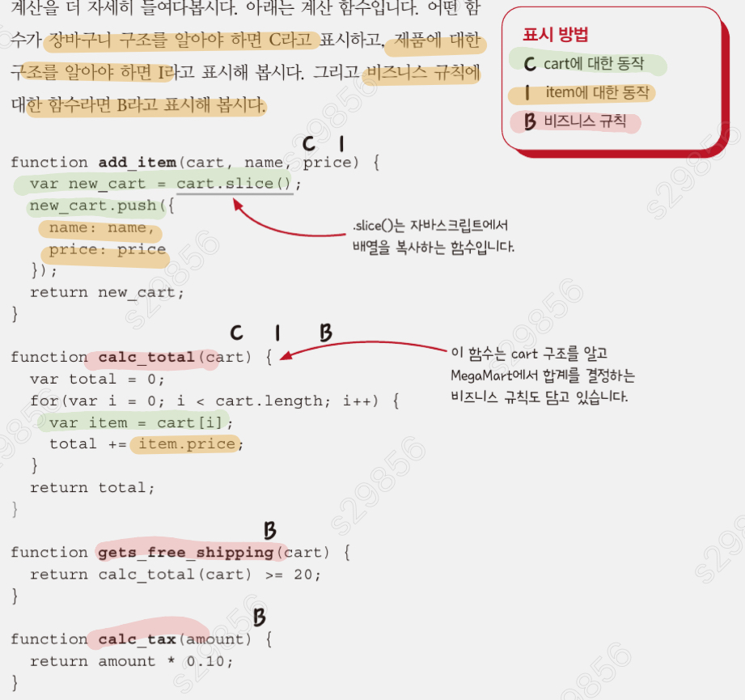
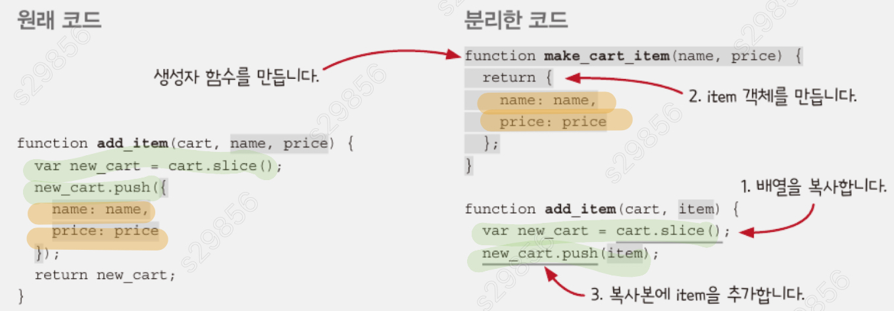

# Chapter 5: 더 좋은 액션 만들기

- 암묵적 입력과 출력을 제거해서 **_재사용하기_** 좋은 코드를 만드는 방법을 알아본다.
- 복잡하게 엉킨 코드를 풀어 더 **_좋은 구조_** 로 만드는 법을 배운다

<hr/>

### 암묵적 입력과 출력은 적을수록 좋다

모든 액션을 계산으로 바꾸진 못해도, 암묵적 입출력을 분리해 재사용성을 높이고 테스트코드 짜기 용이하게 만들 수 있다.

## 액션에서 암묵적 입력과 출력 줄이기

- 전역변수를 읽는 부분을 인자로 바꾸기
- 중복이나 불필요 코드 개선

```
💡전역변수를 읽는다는 의미
전역변수를 읽는다는 것은 코드에서 전역변수에 저장된 값을 가져다 사용하는 것을 뜻합니다.
즉, 어떤 함수나 코드 블록에서 전역변수의 현재 값을 참조하거나 활용하는 경우를 말합니다.

💡왜 단순 값 할당은 전역변수를 읽는 것이 아닌가?
값을 할당하는 경우는, 기존의 값을 활용하지 않고 새로운 값을 전역변수에 덮어쓰기 때문.
값을 읽는 동작이 포함되지 않고, 단순히 전역변수 메모리 영역에 새로운 값을 저장함.
```

```javascript
// As-Is 액션
const shopping_cart = [];
let shopping_cart_total = 0;

function add_item_to_cart(name, price) {
  shopping_cart = add_item(shopping_cart, name, price); //전역변수 읽음
  calc_cart_total();
}

function calc_cart_total() {
  shopping_cart_total = calc_total(shopping_cart); //전역변수 읽음
  set_cart_total_dom();
  update_shipping_icons(shopping_cart);//전역변수 읽음
  update_tax_dom();
}

function set_cart_total_dom(){
    ...
    shopping_cart_total //전역변수 읽음
    ...
}

function update_shipping_icons(cart) {
  const buy_buttons = get_buy_buttons_dom();

  for (let i = 0; i < buy_buttons.length; i++) {
    const button = buy_buttons[i];
    const item = button.item;
    const new_cart = add_Item(cart,item.name,item.price);

    if (get_free_shipping(new_cart)) {
      button.show_free_shipping_icon();
    } else {
      button.hide_free_shipping_icon();
    }
  }
}

function update_tax_dom() {
  set_tax_dom(calc_tax(shopping_cart_total)); //전역변수 읽음
}
```

```javascript
// To-Be 액션
const shopping_cart = [];
let shopping_cart_total = 0;

function add_item_to_cart(name, price) {
  shopping_cart = add_item(shopping_cart, name, price);
  calc_cart_total(shopping_cart); //전역변수 -> 인자
}

function calc_cart_total() {
  let total = calc_total(cart);//전역변수 -> 인자
  set_cart_total_dom(total);//전역변수 -> 인자
  update_shipping_icons(cart);//전역변수 -> 인자
  update_tax_dom(total);//전역변수 -> 인자
  shopping_cart_total = total // 전역변수를 읽는건 아님 단순 값 할당
}

function set_cart_total_dom(total){
    ...
    total //전역변수 -> 인자
    ...
}

function update_shipping_icons(cart) {
  const buy_buttons = get_buy_buttons_dom();

  for (let i = 0; i < buy_buttons.length; i++) {
    const button = buy_buttons[i];
    const item = button.item;
    const new_cart = add_Item(cart,item.name,item.price);

    if (get_free_shipping(new_cart)) {
      button.show_free_shipping_icon();
    } else {
      button.hide_free_shipping_icon();
    }
  }
}


function update_tax_dom(total) {
  set_tax_dom(calc_tax(total)); //전역변수 -> 인자
}
```

## 계산 분류하기



-> item구조만 알고 있는 함수와 cart 구조만 알고 있는 함수로 나눔으로 item,cart의 독립적인 확장이 용이해진다.

```javascript
// As-Is계산
function add_item(cart, name, price) {
  const new_cart = cart.slice();
  new_cart.push({
    name: name,
    price: price,
  });
  return new_cart;
}

function calc_total(cart) {
  return cart.reduce((total, item) => (total += item.price), 0);
}

function get_free_shipping(total, item_price) {
  return total + item_price >= 20;
}

function calc_tax(amount) {
  return amount * 0.1;
}

add_item(shopping_cart, "shoes", 3.45);
```

```javascript
// To-Be계산
function make_cart_item(name, price){//I
  return(
      name:name,
      price:price
  );
}

// 단지 어떠한 배열에 아이템을 push해주는 함수인데 좀 더 추상화 시켜줄 수 있을거같다
function add_item(cart, item) { //C
  const new_cart = cart.slice();
  new_cart.push(item);

  return new_cart;
}

//To-Be add_item
function add_element_last(array, el) {//A
  const new_array = array.slice();
  new_array.push(el);

  return new_array;
}

function calc_total(cart) {
  return cart.reduce((total, item) => (total += item.price), 0);
}

function get_free_shipping(total, item_price) {
  return total + item_price >= 20;
}

function calc_tax(amount) {
  return amount * 0.1;
}

add_item(shopping_cart,make_cart_item("shoes",3.45))
```

## 비즈니스 로직과 서비스 로직

- 두 로직이 공존하는 함수가 있을 순 있지만 냄새나는 코드임으로 분리가 필요함.

<hr/>

# 결론

1. 일반적으로 암묵적 입출력은 인자와 리턴값으로 바꿔 없애는게 좋다
2. 설계란, 엉켜있는 것을 푸는 것이다. 풀려있다면 언제든 재조합 할 수 있다.
3. 엉켜있는 것을 푼다 === 함수가 하나의 일만 하도록 한다 -> 개념을 중심으로 쉽게 구성할 수 있다.

<hr/>

### 나누고 싶은 이야기

1. calc_cart_total 함수가 왜 과한지?

```
본인 의견: 결국 add_Item_to_cart에 종속된 함수이고, return(명시적 출력)이 없어서?
```

2. 카피-온-라이트 패턴을 빼내기?

```
본인 의견: 어떠한 기능에 종속된 함수를 어디서나 사용가능한 유틸리티 함수로 변경하는거 ..?
```
