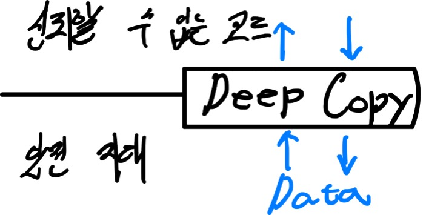

# 7. 신뢰할 수 없는 코드를 쓰면서 불변성 지키기

- 불변성을 지키기 위해 사용하는 카피 온 라이트와 방어적 복사의 차이점을 알고 상황에 맞게 사용할 수 있다.
- 깊은 복사하는 방법들을 살펴본다.

## 우리가 리팩토링한 코드는 신뢰할 수 없는 코드와 상호작용해야 한다.

> 안전 지대: 액션, 계산, 데이터로 나누고, 액션에서 계산을 꺼내고, 카피 온 라이트로 데이터의 불변성을 지키도록 리팩토링한 코드
> 
> 신뢰할 수 없는 코드: 리팩토링하지 않은 레거시 코드나, 외부 라이브러리 코드

### 신뢰할 수 없는 코드와 상호작용 시 문제

1. 안전 지대 밖으로 나가거나, 신뢰할 수 없는 코드에서 들어오는 데이터는 신뢰할 수 없는 코드가 잠재적으로 바꿀 수 있다.
2. 카피온 라이트는 데이터를 바꾸기 전 복사한다(신뢰할 수 없는 코드가 데이터 변경 전에 바꾼다면 예측하기 어렵다).

### 카피 온 라이트의 한계점

- 데어터의 무엇이 바뀌는지 알 수 있기 때문에 무엇을 복사해야 할지 예상할 수 있다.
- 하지만 레거시 코드는 어떤 일이 일어날지 정확히 알 수 없다.
- 데이터가 바뀌는 것을 완벽히 막아주는 원칙이 필요하다.

이 원칙을 **방어적 복사**라고 한다.

## 방어적 복사

### 방어적 복사 규칙



1. 방어적 복사는 깊은 복사를 해야 한다.
2. 데이터가 안전한 코드에서 나갈 때 복사.
3. 데이터가 안전한 코드로 들어올 때 복사.

```js
function add_item_to_cart(name, price){
    const item = make_cart_item(name, price);
    shopping_cart = add_item(shopping_cart, item);
    
    const total = calc_total(shopping_cart);
    set_cart_total_dom(total);
    update_shipping_icons(shopping_cart);
    update_tax_dom(total);
    shopping_cart = black_friday_promotion_safe(shopping_cart);
}

function black_friday_promotion_safe(cart){
    const cart_copy = deepCopy(cart); // 안전 지대에서 나갈 때 복사
    black_friday_promotion(cart_copy); // 신뢰할 수 없는 영역의 코드
    return deepCopy(cart_copy); // 안전 지대로 들어올 때 복사
}
```

### 깊은 복사를 제공하는 여러 메서드

> [얕은 복사와 깊은 복사에 대해서 보면 좋을 아티클](https://soobing.github.io/javascript/deep-copying-objects-with-the-structuredclone-api/)

### 1. JSON.parse(JSON.stringify(obj))

```js
let theOriginalObject = {
  name: "Mary",
  age: 20,
  address: {
    street: "12 Wall St",
    city: "NY",
    state: "New York",
  },
};

let theDeepCopy = JSON.parse(JSON.stringify(theOriginalObject));
```

#### 사용 시 주의 사항

JSON은 객체를 직렬화를 사용해서 문자열로 변환하고, 역직렬화를 통해 객체로 변환한다.
이 과정에서 `Date`는 `string`, `Set`은 `{}`로 변환된다.

### 2. structuredClone

```js
const original = {
  site: "https://blog.openreplay.com/",
  published: new Date(),
  socials: [
    {
      name: "twitter",
      url: "https://twitter.com/openreplay",
    },
    {
      name: "youtube",
      url: "shorturl.at/insT6l", //구독!
    },
  ],
};

const copy = structuredClone(original);
```

#### 사용 시 주의 사항

- 함수, DOM 노드가 포함된 객체를 복사하면 `DataCloneError`가 던져진다.

### 3. Lodash 사용

```js
import { cloneDeep } from 'lodash';
const clone = cloneDeep(original);
```

#### 사용 시 주의 사항

라이브러리 전체를 사용하거나, 함수만 임포트하더라도 깊은 복사를 위해서는 많은 용량이 필요하다고 합니다.

## 카피 온 라이트 vs 방어적 복사

| | 카피 온 라이트                                               | 방어적 복사                                                |
| --- |--------------------------------------------------------|-------------------------------------------------------|
| 사용 시점 | 통제할 수 있는 데이터를 바꿀 때(안전 지대에서 사용하는 데이터)                   | 신뢰할 수 없는 코드와 데이터를 주고 받을 때                             |
| 사용 지점 | 안전 지대 어디서나 쓸 수 있고, 카피 온 라이트가 안전 지대를 만듦                 | 안전 지대의 경계에서 데이터가 오고 갈 때 사용                            |
| 복사 방식 | 얕은 복사                                                  | 깊은 복사                                                 |
| 비용 | 상대적으로 적다. | 상대적으로 비쌈.                                             |
| 규칙 | 1. 바꿀 데이터의 얕은 복사본을 만든다.<br/>2. 복사본을 변경한다.<br/>3. 복사본을 리턴한다. | 1. 안전지대로 들어오는 데이터를 복사한다.<br/>2. 안전지대에서 나가는 데이터를 복사한다. |

## 정리

- 카피 온 라이트를 사용하여 만든 안전 지대에서 데이터를 사용할 때는 상대적으로 비용이 적은 카피 온 라이트를 사용한다.
- 신뢰할 수 없는 영역의 코드와 상호작용 해야 할 경우 방어적 복사를 사용한다.
- 카피 온 라이트와 방어적 복사 모두 데이터의 불변성을 지키기 위함이다.
