# 계층형 설계

> 소프트웨어를 계층으로 구성하는 기술
> 계층형 설계는 바로 아래 계층의 함수로 지금 계층의 함수를 만드는 방법이다

## 소프트웨어 설계

> 코드를 만들고, 테스트하고, 유지보스하기 쉬운 프로그래밍 방법을 선택하기 위해 미적 감각을 사용하는 것

## 계층형 설계 패턴

### 1. 직접 구현

> 직접 구현된 함수를 읽을 때, 함수 시그니처가 나타내고 있는 문제를 함수 본문에서 구체화 수준에서 해결해야 합니다.

### 2. 추상화의 벽

> 호출 그래프에 어떤 계층은 중요한 세부 구현을 감치고 인터페이스를 제공합니다.  
> 인터페이스를 사용하여 코드를 만들면 높은 차원으로 생각할 수 있습니다.

### 3. 작은 인터페이스

> 시스템이 커질수록 비지니스 개념을 나타내는 중요한 인터페이스는 작고 강력한 동작으로 구성하는 것이 좋다.

### 4. 편리한 계층

> 개발자의 요구를 만족시키면서 비즈니스 문제를 잘 풀 수 있어야한다.

### 직접 구현 예제

```javascript
function freeTieClip(cart) {
  let hasTie = false;
  let hasTieClip = false;

  for (let i = 0; i < cart.length; i++) {
    const item = cart[i];
    if (item.name === "tie") {
      hasTie = true;
    }

    if (item.name === "tieClip") {
      hasTieClip = true;
    }
  }

  if (hasTie && !hasTieClip) {
    const tieClip = makeItem("tie clip", 0);
    return addItem(cart, tieClip);
  }

  return cart;
}
```

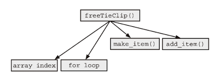;

- 서로 다른 추상화 단계에 있는 기능을 사용하고 있다.
- 직접 구현 패턴을 따르지 않고 있다. (함수가 알아야 할 필요가 없는 구체적인 내용을 담고 있음.)

```javascript
function isInCart(cart, name) {
  for (let i = 0; i < cart.length; i++) {
    let item = cart[i];
    if (item.name === name) {
      return true;
    }
  }
  return false;
}

function isInCart(cart, name) {
  return cart.some((item) => item.name === name);
}

function freeTieClip(cart) {
  const hasTie = isInCart(cart, "tie");
  const hasTie = isInCart(cart, "tieClip");

  if (hasTie && !hasTieClip) {
    const tieClip = makeItem("tie clip", 0);
    return addItem(cart, tieClip);
  }

  return cart;
}
```

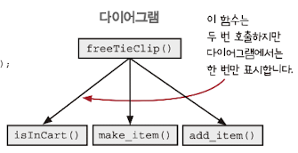

- 전보다 비슷한 추상화 단계의 함수를 사용

> 직접구현 패턴을 사용하면 모든 화살표가 같은 길이를 가져야 한다.  
> 화살표의 길이가 다를때 사용하는 가장 일반적인 방법은 중간에 함수를 추가하는 방법이다.

## 같은 계층에 있는 함수는 같은 목적을 가져야한다.

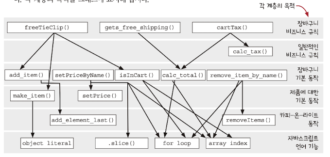

- 계층에서 문제를 찾기 위해 알맞은 줌 레벨을 사용해 하나의 영역을 살펴볼 수 있다.

### 1. 전역 줌 레벨 (그래프 전체)


### 2. 계층 줌 레벨 (한 계층과 그 계층과 연결된 바로 아래 계층)

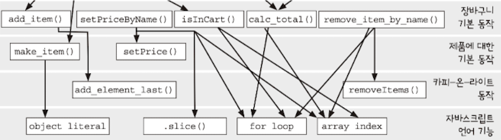

### 3. 함수 줌 레벨 (한 함수와 그 함수와 연결된 바로 아래 함수)

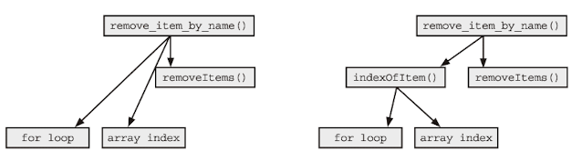

```javascript
function removeItemByName(cart, name) {
  let idx = null;
  for (let i = 0; i < cart.length; i++) {
    if (cart[i].name === name) {
      idx = i;
    }
  }
  if (idx !== null) {
    return removeItems(cart, idx, 1);
  }
  return cart;
}
```

- 서로 다른 계층의 함수를 사용하고 있다.
- 새로운 함수를 추가하여 같은 계층의 함수를 사용하는 것으로 리팩토링

```javascript
function indexOfItem(cart, name) {
  for (let i = 0; i < cart.length; i++) {
    if (cart[i].name === name) {
      return i;
    }
  }
  return null;
}

function indexOfItem(cart, name) {
  const index = cart.find((item) => item.name === name);
  return index ?? null;
}

function removeItemByName(cart, name) {
  const idx = indexOfItem(cart, name);
  if (idx !== null) {
    return removeItems(cart, idx, 1);
  }
  return cart;
}
```

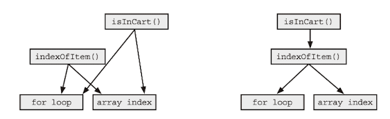

```javascript
function isInCart(cart, name) {
  for (let i = 0; i < cart.length; i++) {
    let item = cart[i];
    if (item.name === name) {
      return true;
    }
  }
  return false;
}
```

- isInCart 함수와 새로 생긴 indexOfItem()이 가리키는 화살표가 같다
- indexOfItems() 함수를 사용하여 화살표의 길이를 줄인다.

```javascript
function indexOfItem(cart, name) {
  for (let i = 0; i < cart.length; i++) {
    if (cart[i].name === name) {
      return i;
    }
  }
  return null;
}

function isInCart(cart, name) {
  return indexOfItem(cart, name) !== null;
}
```

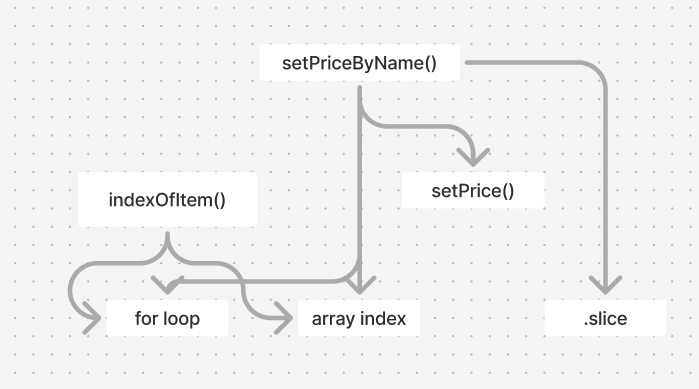

```javascript
function indexOfItem(cart, name) {
  for (let i = 0; i < cart.length; i++) {
    if (cart[i].name === name) {
      return i;
    }
  }
  return null;
}

function setPriceName(cart, name, price) {
  let cartCopy = cart.slice();
  for (let i = 0; i < cartCopy.length; i++) {
    if (cartCopy[i].name === name) {
      cartCopy[i] = setPrice(cartCopy[i], price);
    }
  }
  return cartCopy;
}
```

- setPriceName 함수와 새로 생긴 indexOfItem()이 가리키는 함수가 비슷하다.
- indexOfItems() 함수를 사용하여 화살표의 길이를 줄인다.

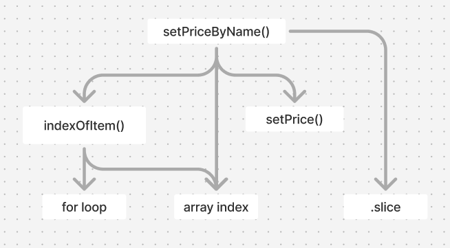

```javascript
function indexOfItem(cart, name) {
  for (let i = 0; i < cart.length; i++) {
    if (cart[i].name === name) {
      return i;
    }
  }
  return null;
}

function setPriceName(cart, name, price) {
  let cartCopy = cart.slice();
  const idx = indexOfItem(cart, name);
  if (idx !== null) {
    cartCopy[idx] = setPrice(cartCopy[idx], price);
  }
  return cartCopy;
}
```

#### 화살표의 길이를 줄이는 것이 항상 좋은 설계(?)는 아니다.

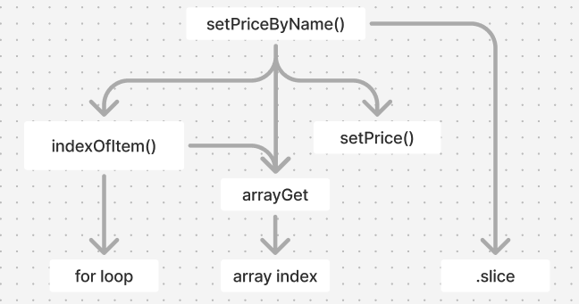

```javascript
function arrayGet(array, index) {
  return array[index];
}

function indexOfItem(cart, name) {
  for (let i = 0; i < cart.length; i++) {
    if (arrayGet(cart, i).name === name) {
      return i;
    }
  }
  return null;
}

function setPriceName(cart, name, price) {
  let cartCopy = cart.slice();
  const idx = indexOfItem(cart, name);
  if (idx !== null) {
    cartCopy[idx] = setPrice(arrayGet(cart, idx), price);
  }
  return cartCopy;
}
```

- 앞서 했던 것들로 코드나 호출 그래프에서 설계를 개선할 수 있는 것들을 찾을 수 있다.
- 결국 좋은 설게를 하기 위해서는 지속적인 탐구와 직관이 필요하다.
- 설계는 어렵고 개발자들도 서로 동의하지 않을 수도 있고, 상황에 따라 좋은 설계의 기준이 달라지기도 한다.
- 설계에 대해 이야기할 때는 같은 용어를 사용하는 것이 중요하고 상황을 고려해서 평가해야 한다.

## 직접 구현 패턴

### 직접 구현한 코드는 한 단계의 구체화 수준에 관한 문제만 해결한다.

> 직접구현하면 코드를 읽기 위해 알아야하는 구체화 단계의 범위를 줄일 수 있다.

### 계층형 설계는 특정 구체화 단계에 집중할 수 있게 도와준다.

### 호출 그래프는 구체화 단계에 대한 풍부한 단서를 보여준다.

### 함수를 추출하면 더 일반적인 함수로 만들 수 있다.

### 일반적인 함수가 많을수록 재사용하기 좋다.

### 복잡성을 감추지 않는다.

> helper 함수를 만드는 것은 계층형 설계가 아니다.  
> 계층형 설계에서 모든 계층은 바로 아래 계층에 의존해야 한다.

## 나의 호출 그래프

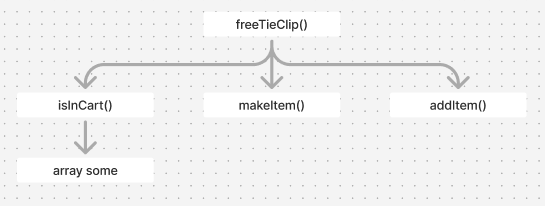
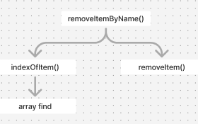
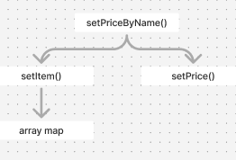

```javascript
function isInCart(cart, name) {
  return cart.some((item) => item.name === name);
}

function freeTieClip(cart) {
  const hasTie = isInCart(cart, "tie");
  const hasTie = isInCart(cart, "tieClip");

  if (hasTie && !hasTieClip) {
    const tieClip = makeItem("tie clip", 0);
    return addItem(cart, tieClip);
  }

  return cart;
}

function indexOfItem(cart, name) {
  const index = cart.findIndex((item) => item.name === name);
  return index === -1 ? null : index;
}

function removeItemByName(cart, name) {
  const idx = indexOfItem(cart, name);
  if (idx !== null) {
    return removeItems(cart, idx, 1);
  }
  return cart;
}

function setItem(cart, name, callback) {
  return array.map((item) => (item.name === name ? callback(item) : item));
}

function setPriceName(cart, name, price) {
  return setItem(cart, name, (item) => setPrice(item, price));
}
```

## 요약

- 어렵다...
- 각 계층을 볼 때 다른 계층의 구체적인 내용을 몰라도 된다.
- 문제 해결을 위한 함수를 구현할 때 어떤 구체화 단계로 쓸지 결정하는 것이 중요하다.
- 함수 이름과 본문, 호출 그래프 등을 사용해서 함수가 어떤 계층에 속할지 결정할 수 있다.
- 함수 이름은 의도를 알려준다.
- 함수 본문은 중요한 세부 사항을 살려준다. 함수가 어떤 계층 구조에 있어야하는지 알려준다.
- 호출 그래프로 구현이 직접적이지 않다는 것을 알 수 있다. 화살표가 다양한 길이를 가지고 있다면 직접 구현되어 있지 않다는 신호이다.

## 나누고 싶은 이야기

- 화살표의 길이를 줄이는 결과물(책의 예시)에 대해 어떻게 생각하는가?
- 이렇게 의견이 나뉘는 경우에는 어떻게 해야할까?
- 고차함수는 어느 레이어일까?
