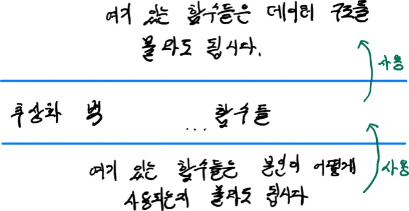
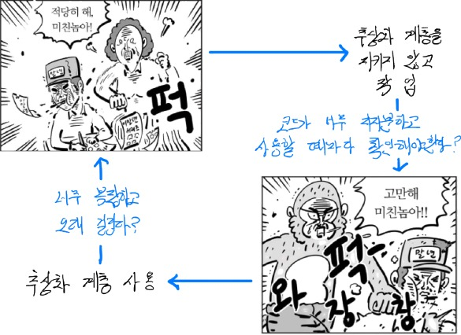
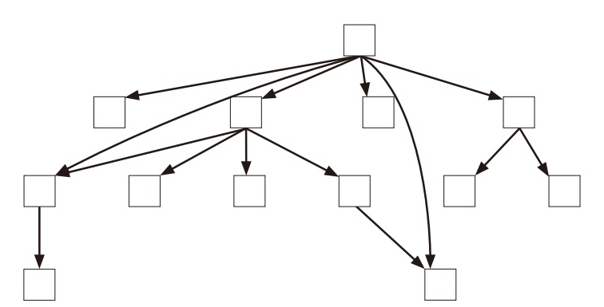
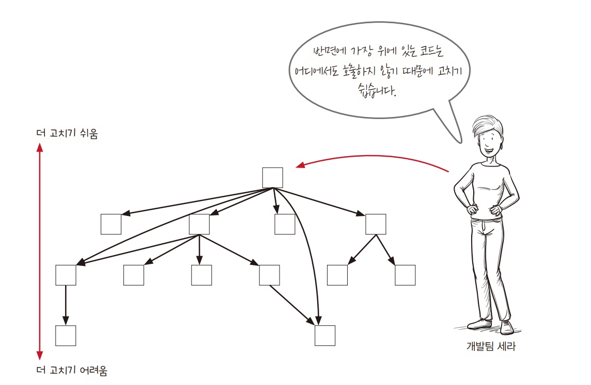
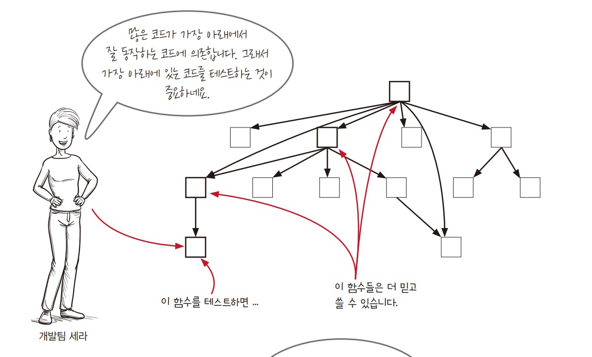
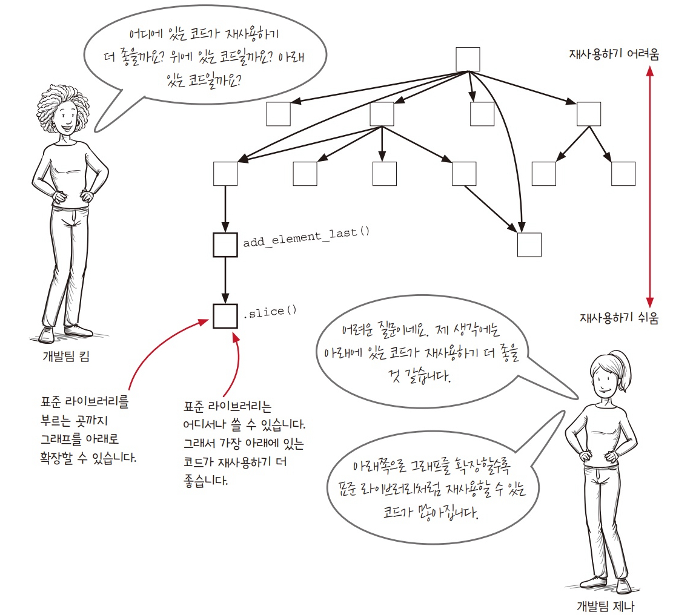

# 9. 계층형 설계 2

> 직접구현
>   - 직접 구현은 계층형 설계 구조를 만드는 데 도움이 된다.
>   - 만약 너무 구체적이라면 코드에서 나는 냄새입니다(책에서는 이와 같은 표현을 사용했는데, '너무 구체적이다 === 같은 계층이 아니다'를 표현한 것 같습니다).

## 2. 추상화 벽

- 세부 구현을 감춘 함수로 이루어진 계층으로 추상화 벽에 있는 함수를 사용할 때는 구현을 전혀 몰라도 함수를 쓸 수 있다.
- 라이브러리 함수를 사용하는 것과 비슷합니다.

```js
function isInCart(cart, name) {
  return indexOfItem(cart, name) !== null;
}
```

### 만약 데이터 구조가 바뀐다면?

- `cart`가 배열에서 객체로 바뀐다면 추상화 벽에 있는 함수만 수정하면 된다.

```js
function isInCart(cart, name) {
   return Reflect.has(cart, name);
}
```



### 정리

- 추상화 벽은 '어떤 것을 신경쓰지 않아도 되지?'라는 말을 표현한 개념이다.
- 계층 구조에서 어떤 계층에 있는 함수들이 공통된 데이터를 신경 쓰지 않아도 된다면 그 계층을 추상화 벽이라고 할 수 있다.
- 추상화 벽을 가로지르는 화살표가 없다는 것도 중요하다.
- 만약 추상화 벽 위에 있는 함수가 추상화 벽 아래에 있는 함수를 호출한다면, 규칙을 어기는 것이다.
- 완전하지 않는 추상화 벽을 완전한 추상화 벽으로 만드는 방법은 추상화 벽에 새로운 함수를 만드는 것이다.
- 추상화 벽은 추상화 벽 아래에 있는 코드와 위에 있는 코드의 의존성을 없앨 수 있다.

## 3. 작은 인터페이스

- 새로운 코드를 추가할 위치에 관한 것이다.
- 인터페이스란 추상화 벽에 만든 함수다.
- 인터페이스를 최소화하면 하위 계층에 불필요한 기능이 쓸데없이 커지는 것을 막을 수 있다.
- 추상화 벽에 코드가 많을 수록 구현이 변경되었을 때 고쳐야 할 것이 많다.

## 4. 편리한 계층

- 강력한 추상화 계층은 만들기 어렵고 시간적으로 오래 걸린다.



## 호출 그래프

- 호출 그래프를 통해 재사용하기, 테스트하기, 고치기 쉬운 코드를 만드는 방법을 알아봅시다.

### 호출 그래프에서 알 수 있는 정보

> 기능적 요구사항: 소프트웨어가 정확히 해야하는 일을 말한다.
> 
> 비기능적 요구사항: 테스트를 어떻게 할건지, 재사용을 잘할 수 있는지, 유지보수하기 어렵지 않은지와 같은 요구사항을 말한다.



- 호출 그래프는 3가지 비기능적 요구사항을 꾸밈없이 보여준다.
 
### 1. 유지보수성: 요구 사항이 바뀌었을 때 가장 쉽게 고칠 수 있는 코드는?



- 그래프의 가장 위에 있는 코드가 고치기 가장 쉽고 반대로 자주 바뀌면 안 되는 코드는 낮은 곳에 있다.
- 가장 위에 있는 함수는 아무 곳에서도 호출하지 않기 때문이다.
- 가장 낮은 계층에 있는 함수는 상위 계층에 영향을 미치므로 연결된 상위 함수를 모두 바꾸어야 한다.
- 같은 높이에 있다면 위로 연결된 것이 적은 함수가 바꾸기 쉽다.

### 2. 테스트성: 어떤 것을 테스트하는 것이 가장 중요한가?



- 아래에 있는 코드는 테스트가 중요하다.
- 많은 코드가 가장 아래에서 잘 동작하는 코드에 의존하기 때문에 가장 아래에 있는 코드를 테스트하는 것이 중요하다.
- 아래에 있는 코드는 자주 바뀌지 않기 때문에 테스트 코드도 자주 고칠 필요없다.

### 3. 재사용성: 어떤 함수가 재사용하기 좋나?



## 정리

- 계층형 설계란 바로 아래 계층의 함수로 현재 계층의 함수를 구현해 코드를 구성하는 기술이다.
- 추상화 벽 패턴을 사용하면 세부적인 것을 완벽히 감출 수 있기 때문에 더 높은 차원에서 생각할 수 있다?
- 패턴을 사용하다보면 너무 과한 추상화를 할 수도 있으므로 요구 사항에 맞게 적용해야 한다.
- 호출 그래프를 통해 어떤 코드가 테스트하기 좋고, 유지보수나 재사용하기 좋은지 알 수 있다.

## 나누고 싶은 이야기

- 패턴2, 3은 명확하게 정리가 안 되는데 같이 이야기 나눠보고 싶습니다.


